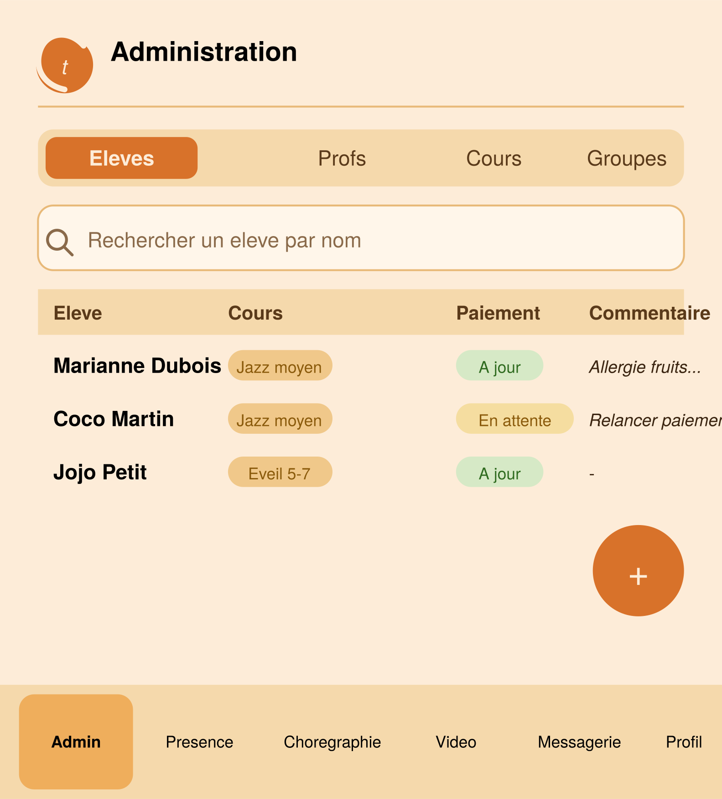
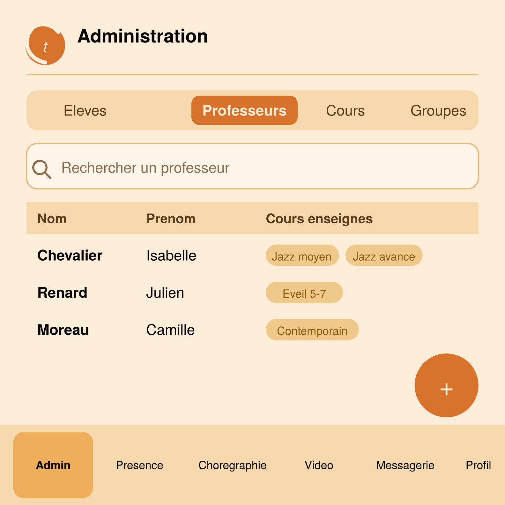
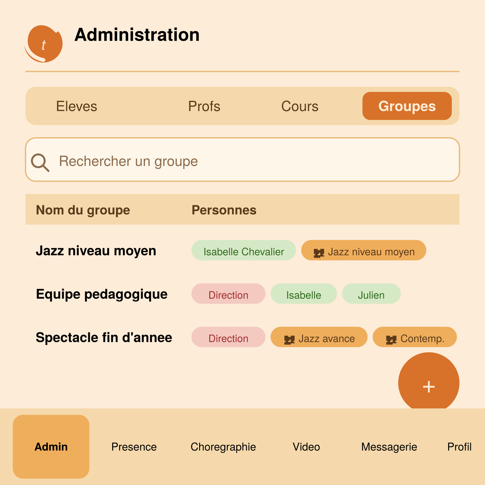
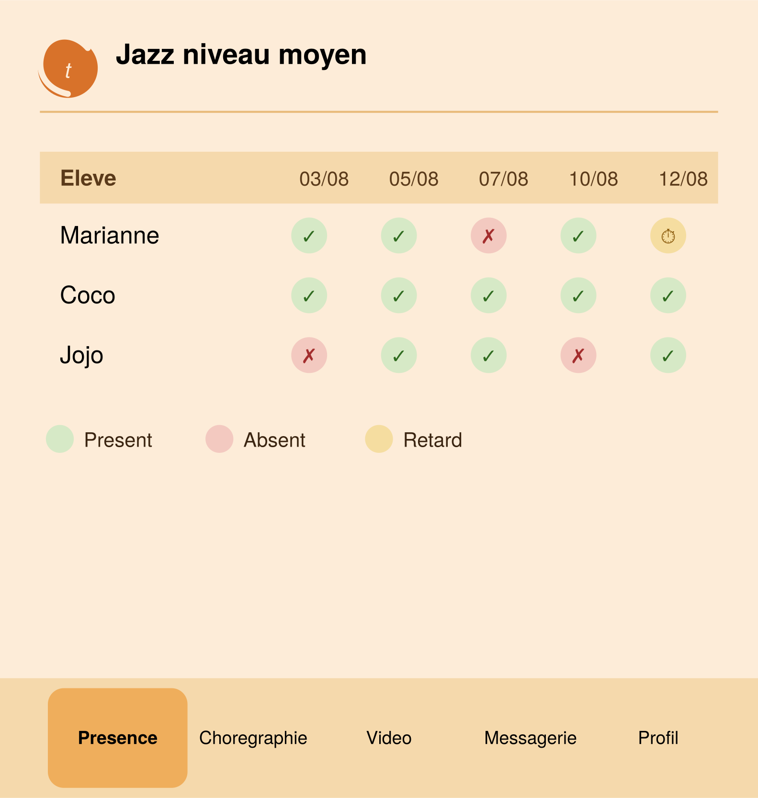
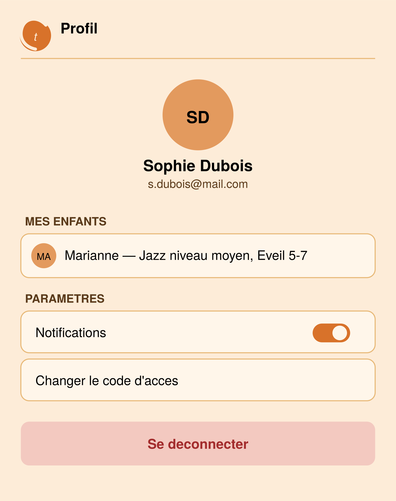

# Spécification — Application Contretemps

Application de gestion pour l'école de danse **Contretemps** (Le Beausset, France).
Web + mobile Android (et iOS si possible), destinée aux admins, professeurs et parents d'élèves.

---

## 1. Stack technique

- **Frontend** : React (web), empaqueté en app mobile via **Capacitor** (Android en priorité, iOS envisagé plus tard)
- **Backend** : Python avec **FastAPI**
- **Base de données** : PostgreSQL
- **Envoi d'emails** : depuis l'adresse `dansecontretemps@gmail.com` (SMTP Gmail avec mot de passe d'application, ou service tiers si le volume augmente)
- **Paiements / inscriptions** : envisagé via **HelloAsso** (gratuit pour les associations) plutôt que Stripe — la base élèves serait synchronisée via l'API HelloAsso plutôt que saisie manuellement: pour l'instant on ne fait rien
- Pas de Mac disponible → build iOS prévu via un service cloud (ex. Codemagic) le cas échéant

---

## 2. Rôles et authentification

Trois rôles : **Admin**, **Professeur**, **Parent**. Pas de rôle "élève" séparé — un élève majeur se connecte comme un parent (de lui-même). Les élèves mineurs n'ont pas de compte ; ils sont des fiches gérées par leur parent.

### Connexion

- Champ **Email** : identifie précisément la personne connectée (recherché dans les tables `parents`, `professeurs`, ou `admins`)
- Champ **Code** : code d'accès partagé par rôle (ex. `ADMIN2026`, `PROF2026`, `PARENT2026`), sert uniquement à vérifier que la personne connaît le code de son rôle — ce n'est pas un identifiant individuel
- Le code doit correspondre au rôle réellement associé à l'email (cohérence vérifiée côté serveur)
- Session persistante (web et mobile) sans reconnexion systématique — token stocké en local (localStorage/cookie sécurisé côté web, stockage sécurisé natif côté mobile)
- Plusieurs appareils peuvent être connectés simultanément avec le même email/code (ex. un parent et ses deux filles majeures, chacun sur son téléphone)
- Déconnexion disponible depuis l'onglet **Profil**


---

## 3. Droits par rôle


| Fonctionnalité                                    | Admin | Professeur | Parent                          |
| ------------------------------------------------- | ----- | ---------- | ------------------------------- |
| Onglet Admin (gestion élèves/profs/cours/groupes) | ✅     | ❌          | ❌                               |
| Onglet Présence                                   | ✅     | ✅          | ❌                               |
| Onglet Chorégraphie(consultation)                 | ✅     | ✅          | ✅                               |
| Ajout/suppression/modification Chorégraphie       | ✅     | ✅          | ❌                               |
| Onglet Vidéo (consultation)                       | ✅     | ✅          | ✅                               |
| Ajout/suppression une vidéo                       | ✅     | ✅          | ✅ (pour le cours de son enfant) |
| Messagerie (chat, envoi mail)                     | ✅     | ✅          | ✅                               |
| Onglet Profil                                     | ✅     | ✅          | ✅                               |

*Le détail fin des droits (ex. un prof peut-il modifier la présence d'un cours qui n'est pas le sien : non, car il n'aura accès qu'a ses cours) reste à préciser lors du développement.*

---

## 4. Navigation par rôle

- **Admin** : Admin · Présence · Chorégraphie · Vidéo · Messagerie · Profil .  Presence, Chorégraphie · Vidéo · accesible pour tous les cours. Messagerie: toutes les conversations
- **Professeur** : Présence · Chorégraphie · Vidéo · Messagerie · Profil.  Presence, Chorégraphie · Vidéo · accesibles du cours selectionné dans le selecteur de cours. Messagerie: toutes les conversation dans lequel le prof est enregistré
- **Parent** : Chorégraphie · Vidéo · Messagerie · Profil.   Chorégraphie · Vidéo · accesible du cours selectionné. Messagerie: toutes les conversation dans lequel le prof est enregistré

L'en-tête de chaque écran (hors Admin) affiche :

- Logo Contretemps (à gauche)
- **Sélecteur de cours** : bouton avec le nom du cours actif + chevron, ouvre un menu déroulant listant tous les cours du prof/parent.      L'admin a accés a tous les cours.  Le prof et le parent a ceux ou ils sont inscrits
- **Sélecteur d'élève** (pour les parents ayant plusieurs enfants) : avatar avec initiales + petit badge chevron, ouvre la liste des enfants du foyer
- Menu hamburger (à droite)

---

## 5. Écrans

*Ordre suivant la navigation du rôle Admin (le plus complet) : Admin · Présence · Chorégraphie · Vidéo · Messagerie · Profil.*

### 5.1 Admin *(Admin uniquement)*

Onglet le plus à gauche de la barre, réservé exclusivement au rôle Admin. Contient 4 sous-onglets (sélecteur segmenté en haut de l'écran) : Élèves, Professeurs, Cours, Groupes.

#### 5.1.1 Élèves

Barre de recherche par nom, tableau avec 10 colonnes : Élève, Cours suivis (plusieurs cours possibles par élève, badges), Statut paiement, Commentaire libre, Date de naissance, Parent/contact, Téléphone, Email, Adresse, Certificat médical.

Chaque cellule est éditable au clic (input inline pour texte court, sélecteur de date natif, fenêtre à cases à cocher pour les cours, menu déroulant pour le paiement, modale plein écran pour le commentaire). Bouton **+** flottant pour ajouter un élève, icône poubelle par ligne pour supprimer.



#### 5.1.2 Professeurs

Même principe : Nom, Prénom, Cours enseignés (un prof peut enseigner plusieurs cours). Ajout/suppression identiques.



#### 5.1.3 Cours

Colonnes : Nom du cours, Horaire, Professeur (un seul par cours), Élèves inscrits (badges, "+X" si liste longue). Ajout/suppression identiques.


#### 5.1.4 Groupes de conversation

Gestion des groupes de conversation de la messagerie. Colonnes : Nom du groupe, Personnes. Pas de filtres sous la recherche.

La composition d'un groupe se fait à partir de trois types de blocs (pas d'ajout d'élève individuel) :

- **Admin** (ex. "Direction")
- **Professeur** (individuel)
- **Cours** (représente automatiquement tous les élèves inscrits à ce cours)

Exemples : "Jazz niveau moyen" = la prof + tous les élèves du cours ; "Spectacle fin d'année" = direction + élèves de plusieurs cours différents.



### 5.2 Présence *(Admin, Professeur)*

Tableau avec les élèves en lignes et les dates de cours en colonnes (défilement horizontal, colonne "Élève" fixe à gauche). Statuts par case : présent (vert), absent (rouge), retard (orange), avec légende sous le tableau.



### 5.3 Chorégraphie *(Admin, Professeur, Parent)*

- Zone haute fixe et défilante : liste des chorégraphies du cours sélectionné (icône musique, nombre d'élèves)
- Zone basse : détail de la chorégraphie sélectionnée, organisé en sections — **Élèves** (liste), **Costume** (texte libre), **Horaire de répétition**, **Liens vidéos**


### 


### 5.4 Vidéo *(Admin, Professeur, Parent)*

Liste défilante de vidéos (une chorégraphie filmée par entrée) : vignette avec bouton play et durée, titre, date de publication, description optionnelle. Bouton **+** flottant en bas à droite pour ajouter une vidéo (accessible aux 3 rôles).


### 5.5 Messagerie *(Admin, Professeur, Parent)*

- Zone haute fixe et défilante : liste des conversations (groupes ou individuelles), avec icône groupe/avatar individuel, aperçu du dernier message, indicateur mail (si le dernier message a été relayé par email)
- Zone basse : fil de la conversation sélectionnée — bulles de message, coches de statut (envoyé / reçu / vu, façon WhatsApp), bouton "Envoyer par mail" par message (révélé au survol/appui long)
- Envoi de nouveaux messages via un champ de saisie en bas


Ce n'est pas present sur l'image, mais il faudrait pour les message les coches d'etat.   Et aussi pouvoir egalement envoyer un message par mail. Et savoir si un message est envoyé par mail (icone mail)   : ceci montre un peut ce que la messagerie doit faire


### 5.6 ### Profil *(tous les rôles)*

⚠️ **Écran non maquetté en détail durant la conversation** — proposition à valider, pas une spécification validée comme le reste du document.

Contient a minima : identité de la personne connectée, liste des enfants rattachés (pour un parent), paramètres (notifications, changement de code), et le bouton **Se déconnecter**.



---

## 6. Schéma de base de données (proposition)

### Personnes

```
parents        : id, nom, prenom, email (unique), telephone, adresse
professeurs    : id, nom, prenom, email (unique)
admins         : id, nom, prenom, email (unique)
eleves         : id, nom, prenom, date_naissance, parent_id (FK), date_inscription,
                 statut_paiement (enum), certificat_medical, taille_costume, commentaire (text)
```

*Un `parent_id` unique par élève permet nativement "plusieurs enfants, un seul parent".*

### Cours

```
cours          : id, nom, jour, heure_debut, heure_fin, salle, professeur_id (FK)
eleves_cours   : eleve_id (FK), cours_id (FK)   -- liaison many-to-many
```

### Présence

```
presences      : id, eleve_id (FK), cours_id (FK), date, statut (enum: present/absent/retard)
```

### Chorégraphies

```
choregraphies          : id, cours_id (FK), nom, costume, horaire_repetition, salle_repetition
choregraphies_eleves    : choregraphie_id (FK), eleve_id (FK)
videos_choregraphie      : id, choregraphie_id (FK), url, titre, description (nullable)
```

### Vidéos de cours

```
videos         : id, cours_id (FK), titre, url, description (nullable), date_publication, uploaded_by
```

### Messagerie

```
groupes         : id, nom
groupe_membres  : id, groupe_id (FK), membre_type (enum: admin/professeur/cours), membre_id
                  -- champ polymorphe : membre_id pointe vers admins, professeurs, ou cours
                  -- selon membre_type. Un "cours" se résout dynamiquement en tous ses élèves.
conversations   : id, type (enum: groupe/individuelle), groupe_id (FK, nullable),
                  participant_a_type, participant_a_id,
                  participant_b_type, participant_b_id (nullable si groupe)
messages        : id, conversation_id (FK), expediteur_type, expediteur_id, contenu,
                  envoye_par_mail (bool), statut (enum: envoye/recu/vu), created_at
```

**⚠️ Point d'attention** : le champ polymorphe (`membre_type` + `membre_id`) n'est pas une vraie clé étrangère SQL classique — l'intégrité référentielle doit être vérifiée côté application (backend), pas garantie nativement par la base de données.

---

## 7. Charte visuelle

- **Fond** : orange clair (`#FDECD8`)
- **Texte principal** : noir / brun foncé (`#000`, `#3A2410`)
- **Accent** : orange soutenu (`#D8722A`)
- **Logo** : monogramme "Ct" — un grand C en arc entourant un "t" italique, sur fond circulaire orange
- Icônes : style Tabler Icons (traits fins, cohérents)
- Barre de navigation basse fixe, en fond orange clair légèrement plus soutenu que le fond général

---

## 8. Points restant à trancher

- Détail fin des droits par rôle (ex. un prof peut-il agir sur un cours qui n'est pas le sien ?)
- Upload vidéo direct (stockage) vs lien externe (YouTube/Vimeo privé) — impacte fortement coût et complexité
- Notifications : push en plus du mail, ou mail uniquement ?
- Intégration HelloAsso : synchronisation ponctuelle ou temps réel via webhook ?
- Politique de confidentialité (obligatoire, données concernant des mineurs)
