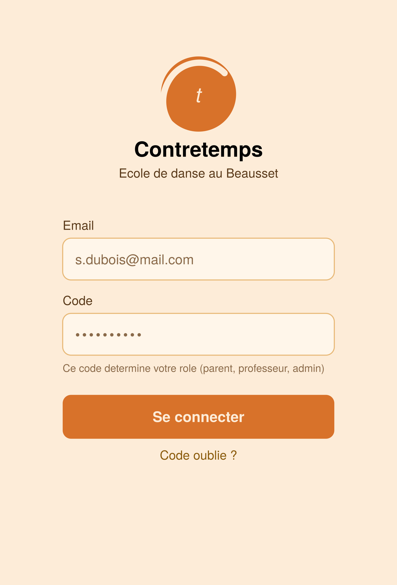
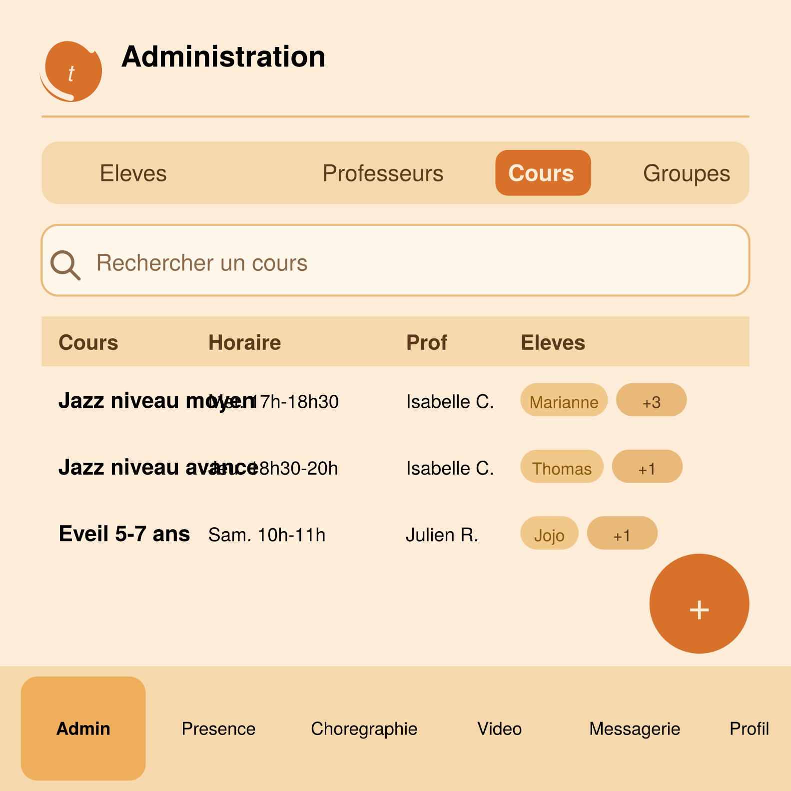
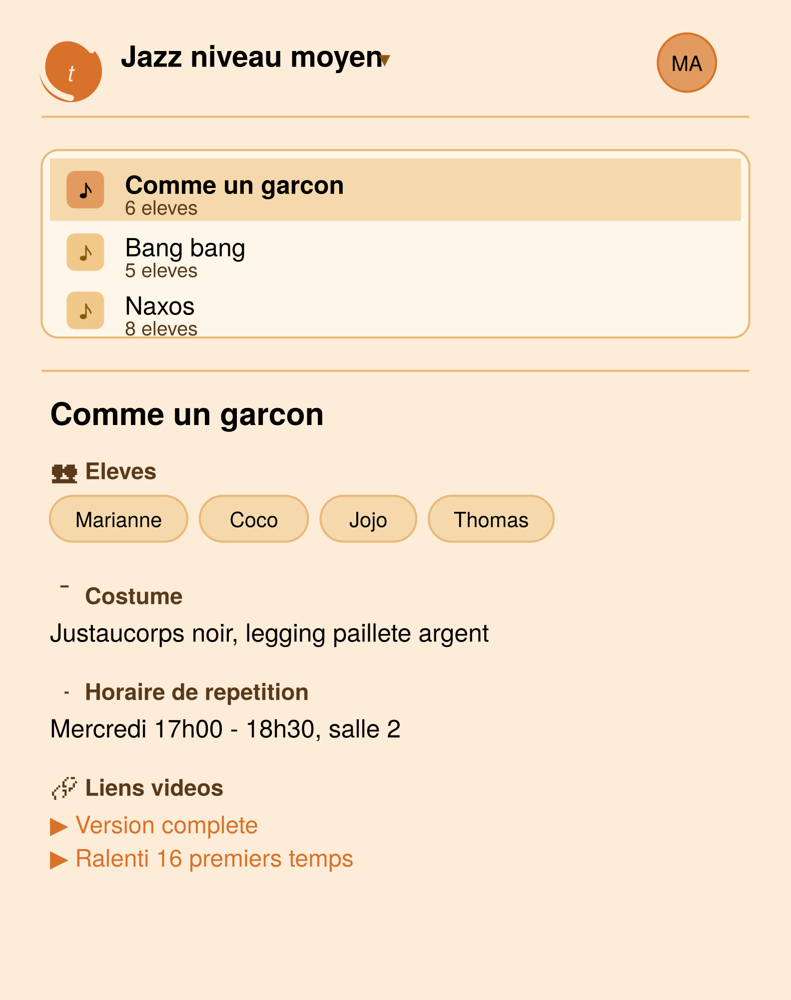
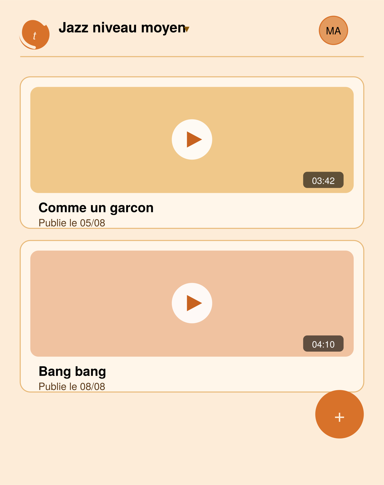
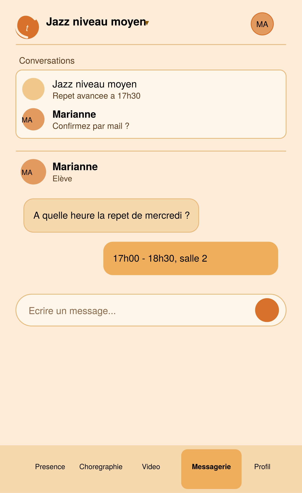
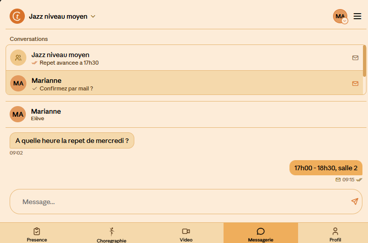

# Spécification — Application Contretemps

Application de gestion pour écoles de danse, multi-écoles dès la conception, avec
**EcoleTest** et **Contretemps** (Le Beausset, France) comme premières écoles gérées.
Web + mobile Android (et iOS si possible), destinée aux admins, professeurs et élèves/familles.

---

## 1. Stack technique

- **Frontend** : React (web), empaqueté en app mobile via **Capacitor** (Android en priorité, iOS envisagé plus tard)
- **Backend** : Python avec **FastAPI**
- **Base de données** : PostgreSQL
- **Envoi d'emails** : depuis l'adresse `dansecontretemps@gmail.com` (SMTP Gmail avec mot de passe d'application, ou service tiers si le volume augmente)
- **Paiements / inscriptions** : envisagé via **HelloAsso** (gratuit pour les associations) plutôt que Stripe — pour l'instant on ne fait rien de ce côté
- Pas de Mac disponible → build iOS prévu via un service cloud (ex. Codemagic) le cas échéant

---

## 2. Rôles, comptes, écoles et authentification

### 2.1 Philosophie multi-écoles

L'application gère plusieurs écoles, dont les données sont **totalement indépendantes et
étanches** les unes des autres. Dans un premier temps, deux écoles : **EcoleTest** et
**Contretemps**.

Trois rôles au sein d'une école : **Admin**, **Professeur**, **Élève**. Il n'y a pas de rôle
"Parent" séparé — un élève est lui-même un compte, avec ses propres champs (voir §6), qu'il
soit mineur ou majeur.

**Profils familiaux façon Netflix** : au sein d'une même école, les comptes (admin, professeur,
élève) qui partagent le même email sont automatiquement regroupés en une même **famille**.
Toute personne connectée peut, via un menu déroulant, **basculer sans reconnexion** vers un
autre profil de la même famille — ex. un parent-admin qui bascule vers le profil de son fils
élève, ou entre deux enfants d'une même fratrie. Une famille peut mélanger les rôles (ex. un
parent Admin + ses deux enfants Élèves).

### 2.2 Connexion

- **Admin / Professeur** : connexion par **nom + prénom OU email** + code d'accès partagé par
  rôle et par école (ex. `ADMIN2026`)
- **Élève** : connexion par **nom + prénom OU email** + code d'accès (`ELEVE2026`) — l'email
  n'est pas requis pour se connecter, mais s'il est renseigné, il sert au regroupement familial
  et aux notifications
- Le code doit correspondre au rôle réellement associé au compte, **dans l'école concernée**
  (cohérence vérifiée côté serveur)
- Session persistante (web et mobile) sans reconnexion systématique — token stocké en local
- Plusieurs appareils peuvent être connectés simultanément avec le même compte
- Déconnexion disponible depuis l'onglet **Profil**

**✅ Tranché — règle de sécurité du switch de profil famille** : le code d'accès du rôle
cible est redemandé uniquement en cas de **montée en privilège**, selon la hiérarchie
Élève < Professeur < Admin :
- Élève → Professeur ou Admin : code redemandé
- Professeur → Admin : code redemandé
- Tous les autres cas (vers un rôle égal ou inférieur, ex. Admin → Élève, Professeur → Élève) : switch libre, sans redemander de code


*(capture à reprendre par Claude Code une fois l'écran adapté à la nouvelle logique)*

### 2.3 Création d'une nouvelle école

Sur la page de connexion, un bouton **"Nouvelle école ?"** ouvre un formulaire de création :

- Nom de l'école
- Code postal — **obligatoire** : sert à distinguer deux écoles portant le même nom (ex. deux
  "Contretemps" dans des villes différentes), voir §6.1
- Code d'accès Admin, Professeur, Élève — **libres**, proposés par défaut sous la forme
  `ADMIN_ECOLE_ANNEE` / `PROF_ECOLE_ANNEE` / `ELEVE_ECOLE_ANNEE` (ÉCOLE = nom de l'école en
  majuscules, ANNÉE = année en cours), éditables avant validation
- Nom, prénom et email du premier administrateur

La validation du formulaire crée l'école **et** le compte du premier administrateur en une
seule opération. Cet administrateur pourra ensuite modifier les 3 codes d'accès de l'école
depuis les paramètres (tout admin peut les modifier par la suite, pas seulement le créateur).

---

## 3. Droits par rôle

| Fonctionnalité                                    | Admin | Professeur | Élève                              |
| ------------------------------------------------- | ----- | ---------- | ----------------------------------- |
| Onglet Admin (gestion élèves/profs/cours/conversations) | ✅ | ❌      | ❌                                   |
| Onglet Présence                                   | ✅     | ✅          | ❌                                   |
| Onglet Chorégraphie (consultation)                | ✅     | ✅          | ✅                                   |
| Ajout/suppression/modification Chorégraphie       | ✅     | ✅          | ❌                                   |
| Onglet Vidéo (consultation)                       | ✅     | ✅          | ✅                                   |
| Ajout/suppression une vidéo                       | ✅     | ✅          | ✅ (pour le cours où il est inscrit) |
| Messagerie (conversations, envoi mail)            | ✅     | ✅          | ✅                                   |
| Onglet Profil                                     | ✅     | ✅          | ✅                                   |
| Comptage d'heures (voir §5.7)                     | ✅ (tous les profs) | ✅ (soi-même uniquement) | ❌                       |
| Export du relevé d'heures (PDF/Excel/Drive)       | ✅     | ❌          | ❌                                   |

*Le détail fin des droits (ex. un prof peut-il agir sur un cours qui n'est pas le sien) reste
à préciser lors du développement.*

---

## 4. Navigation par rôle

- **Admin** : Admin · Présence · Chorégraphie · Vidéo · Messagerie · Profil. Accès à tous les cours de son école. Messagerie : toutes les conversations.
- **Professeur** : Présence · Chorégraphie · Vidéo · Messagerie · Profil. Accès aux cours où il est inscrit (sélecteur de cours). Messagerie : toutes les conversations où il est membre.
- **Élève** : Chorégraphie · Vidéo · Messagerie · Profil. Accès aux cours où il est inscrit. Messagerie : toutes les conversations où il est membre.

L'en-tête de chaque écran (hors Admin) affiche :

- **Zone gauche** : logo de l'école, et généralement le **sélecteur de cours** (cours actif + chevron, menu déroulant listant les cours accessibles)
- **Zone droite** : **sélecteur de profil famille**, affiché **uniquement si le compte connecté appartient à une famille de plus d'1 membre** (avatar + chevron, menu déroulant permanent listant les profils du foyer) — invisible/absent pour un compte seul dans sa famille
- **Menu 3 points verticaux** : propose l'accès au **Profil** et la **Déconnexion**

---

## 5. Écrans

*Ordre suivant la navigation du rôle Admin (le plus complet) : Admin · Présence · Chorégraphie · Vidéo · Messagerie · Profil.*

**⚠️ Toutes les captures d'écran ci-dessous datent de l'ancienne logique de rôles
(Admin/Professeur/Parent, mono-école) et sont à reprendre par Claude Code une fois l'IHM
adaptée.**

### 5.1 Admin *(Admin uniquement)*

Sous-onglets (sélecteur segmenté) : École, Élèves, Professeurs, Cours, Conversations. Si les
sous-onglets ne tiennent pas sur une seule ligne (écran étroit), **retour à la ligne
automatique** plutôt que défilement horizontal — tous les onglets restent visibles sans
interaction supplémentaire.

#### 5.1.1 École

Nom de l'école, code postal, et les 3 codes d'accès (Admin/Professeur/Élève), modifiables par
tout admin. Onglet le plus à gauche du sélecteur segmenté.

**Bouton "Usage vidéo"** : ouvre un panneau d'information sur les vidéos de l'école (tous cours
confondus) — espace utilisé (Mo tant que ça reste sous 1 Go, Go au-delà) et durée totale
(secondes tant que ça reste sous la minute, minutes au-delà), puis les 10 vidéos les plus
lourdes par taille décroissante (titre, cours, chorégraphie liée si elle existe, taille, durée).
Icône poubelle par ligne pour supprimer une vidéo directement depuis ce panneau (confirmation
demandée) — supprime aussi le fichier et sa vignette, pas seulement l'entrée.

#### 5.1.2 Élèves

Tableau éditable — voir la liste complète des champs en §6.4, plus une colonne **Âge** juste
après **Date de naissance** (calculée à la volée, non éditable directement). Bouton **+**
flottant pour ajouter, icône poubelle par ligne pour supprimer. Bouton **"Importer depuis
Excel"** — mécanisme détaillé en §6.4bis (mapping des colonnes de cours, alerte sur colonne
inconnue).


#### 5.1.3 Professeurs

Nom, Prénom, Email, Téléphone, cours enseignés (badges, plusieurs cours possibles).


#### 5.1.4 Cours

Nom, horaire, salle, descriptif, professeur(s) (badges, plusieurs profs possibles par cours),
élèves inscrits (badges, "+X" si liste longue).

**Menu 3 points** (en-tête de l'écran, discret, même langage que les autres menus 3 points de
l'app) : propose **"Planning hebdomadaire"**, qui ouvre une vue dédiée — grille des jours de
la semaine (colonnes) et créneaux horaires (lignes), avec chaque cours positionné selon son
horaire. Case à cocher "Afficher le nom du prof" (prénom uniquement). Sur les créneaux courts,
les informations les moins prioritaires (salle, puis prénom du prof) se masquent
automatiquement si la place manque, plutôt que d'être coupées à moitié.

Dans le même menu 3 points de cette vue planning : **"Exporter en PDF"** et **"Exporter en PDF
sans professeur"**.




#### 5.1.5 Conversations *(gestion admin des conversations de groupe)*

Colonnes : Nom, Membres. Contient à la fois les conversations automatiques (une par cours,
créées dès la création du cours) et celles créées manuellement par l'admin. Les deux sont
éditables ici : composition modifiable à partir de deux types de blocs :

- **Compte individuel** (admin, professeur, ou élève) — sert notamment à ajouter des
  "membres spéciaux" à la conversation automatique d'un cours, en plus de sa composition de base
- **Cours** (résout automatiquement en tous les élèves inscrits **et** le(s) professeur(s) du cours)


### 5.2 Présence *(Admin, Professeur)*

Une **séance de présence** par cours et par date. Tableau avec les dates en colonnes
(défilement horizontal, colonne fixe à gauche), et en lignes :

- **Chaque élève du cours** : statut par case, présent (vert) / absent (rouge) / retard (orange)
- **Pour chaque professeur du cours** : 3 lignes — "Heure début cours", "Heure fin cours"
  (saisie d'heure, pas de statut à cocher ; la présence du prof est déduite automatiquement
  de ces heures, voir §6.6) et **"Dépassement (min)"** (déclaration libre d'un dépassement
  d'horaire en minutes pour cette séance)


### 5.3 Chorégraphie *(Admin, Professeur, Élève)*

- Zone haute : liste des chorégraphies du cours sélectionné
- Zone basse : détail — **Élèves participants** (sélection spécifique parmi les élèves du cours, pas automatiquement tous), **Costume** (un seul texte pour toute la chorégraphie), **Horaire de répétition**, **Vidéos liées** (calculé, voir §6.7)
- **Créer/modifier/supprimer une chorégraphie réservé à Admin et Professeur** — un élève consulte seulement (pas de bouton **+**, pas de bouton d'édition/suppression). Différent de l'écran Vidéo (§5.4), où le **+** est ouvert aux 3 rôles.



### 5.4 Vidéo *(Admin, Professeur, Élève)*

Liste défilante de vidéos : vignette, titre, date, description optionnelle, chorégraphie liée
(optionnelle). Bouton **+** flottant pour ajouter (accessible aux 3 rôles).



### 5.5 Messagerie *(Admin, Professeur, Élève)*

Un seul concept : **conversations** (individuelles ou de groupe), pas de distinction de
vocabulaire entre l'admin et l'utilisateur (voir §6.8).

- Liste des conversations, aperçu du dernier message, indicateur mail
- Fil de la conversation : bulles de message, coches de statut **envoyé / reçu / vu** (façon WhatsApp), bouton "Envoyer par mail" par message
- **Dans une conversation à plusieurs membres**, le canal (app/email) et le statut de lecture sont **par destinataire**, pas par message global — icône agrégée sur le message (ex. "✉️ 2"), détail par personne accessible au tap (façon accusés de lecture WhatsApp en groupe)
- **Relance automatique par email** : message non lu après un délai (proposition : 15 min) → email automatique, couvre le cas d'un compte qui n'a jamais ouvert l'app
- **Envoi volontaire par email** : case à cocher pour un envoi immédiat — **réservé aux rôles Admin et Professeur** (un élève ne peut pas déclencher d'envoi email volontaire, seulement la relance automatique standard).




### 5.6 Profil *(tous les rôles)*

⚠️ **Proposition non validée.** Identité de la personne connectée, autres profils de la
famille, paramètres (notifications, changement de code), bouton **Se déconnecter**. Pour un
compte Professeur, lien **"Mes heures"** vers l'écran Comptage d'heures (§5.7).


### 5.7 Comptage d'heures — relevé d'heures *(nouveau — Admin et Professeur)*

Pas un onglet de navigation principal — accessible depuis deux points d'entrée qui mènent au
**même écran** :
- **Admin** : depuis Admin → Professeurs, clic sur un professeur → bouton/onglet "Heures"
  (l'admin peut consulter les heures de n'importe quel prof)
- **Professeur** : depuis Profil → lien "Mes heures" (uniquement ses propres heures)

**En-tête** : nom du professeur, **sélecteur de période** (liste des mois disponibles +
option **"Toute la période"** pour un cumul sans limite de temps), **sélecteur d'export**
(PDF / Excel / Google Drive — voir note technique ci-dessous).

**Tableau chronologique** : une ligne par séance passée du professeur, **tous cours
confondus** (colonne "Cours" pour les distinguer) — Date, Cours, Heure début, Heure fin,
Heures sup, Heures normales (calculée). Ligne de total en pied de tableau : total Heures
normales et total Heures sup pour la période sélectionnée.

**Formule** (corrigée) : `heures normales = (heure_fin_reelle - heure_debut_reelle) -
depassement_minutes` — le dépassement est **inclus** dans l'intervalle début/fin, pas ajouté
en plus.

**Exports** *(réservé à l'Admin — un professeur consulte ses heures mais ne peut pas exporter)* :
- **PDF** et **Excel** : génération du tableau de la période affichée (mois sélectionné, ou
  cumul complet si "Toute la période")
- **Google Drive** : dépôt direct du fichier généré (PDF ou Excel) dans le Drive de
  l'utilisateur — réutilise l'intégration OAuth2 Google déjà envisagée (scope d'écriture
  `drive.file`)

**⚠️ Ce n'est pas une fiche de salaire.** Ce tableau est un **relevé d'heures** (justificatif
d'heures travaillées), pas un bulletin de paie légal — un vrai bulletin de paie nécessite des
mentions obligatoires (SIRET, convention collective, cotisations sociales détaillées, cumuls
annuels) qui relèvent d'un logiciel de paie dédié ou d'un comptable. Ce relevé sert d'**entrée**
à ce calcul, pas de substitut.

Toutes les heures affichées sont **calculées à la volée**, jamais stockées — dérivées de
`presence_profs` (§6.6).


---

## 6. Base de données

Convention utilisée pour chaque table : **Obl.** = obligatoire, **Opt.** = optionnel,
**Éditable** = saisi/modifié par un utilisateur, **Calculé** = jamais stocké, dérivé d'une
requête sur une autre table (relation inverse) — précisé pour répondre à la question sur les
champs techniques.

### 6.1 Écoles

| Champ | Type | Obl./Opt. |
|---|---|---|
| id | PK | — |
| nom | texte | Obl. |
| code_postal | texte | Obl. |
| code_acces_admin | texte | Obl. |
| code_acces_prof | texte | Obl. |
| code_acces_eleve | texte | Obl. |
| created_at | datetime | Obl. (auto) |

**Le nom seul n'est pas unique** : deux écoles différentes peuvent porter le même nom (ex. deux
associations "Contretemps" dans des villes différentes) — c'est le couple **(nom, code_postal)**
qui doit être unique, pas le nom seul. D'où le code postal obligatoire dès la création.

Modifiable par tout admin de l'école après création. Les 3 codes d'accès sont **libres** (texte
éditable sans contrainte de format imposée) — à la création de l'école, une valeur par défaut
est proposée pour chacun (`ADMIN_ECOLE_ANNEE`, `PROF_ECOLE_ANNEE`, `ELEVE_ECOLE_ANNEE`, où
ÉCOLE = nom de l'école en majuscules et ANNÉE = année en cours), éditable avant validation.

### 6.2 Familles

| Champ | Type | Obl./Opt. |
|---|---|---|
| id | PK | — |
| ecole_id | FK → écoles | Obl. |

Calculée automatiquement : à la création d'un compte, si l'email saisi existe déjà pour un
autre compte de la même école, le nouveau compte rejoint la même famille ; sinon une nouvelle
famille est créée. Un compte sans email reste seul dans sa propre famille.

### 6.3 Comptes (partie commune Admin/Professeur/Élève)

| Champ | Type | Obl./Opt. |
|---|---|---|
| id | PK | — |
| ecole_id | FK → écoles | Obl. |
| famille_id | FK → familles | Obl. (calculé) |
| role | enum (admin/professeur/eleve) | Obl. |
| nom | texte | Obl. |
| prenom | texte | Obl. |
| email | texte | Opt. |
| telephone | texte | Opt. |
| hashed_password_ou_code | texte | technique |
| created_at | datetime | Obl. (auto) |

*Admin* : aucun champ supplémentaire pour l'instant — pas besoin de table séparée.
*Professeur* : aucun champ supplémentaire propre pour l'instant (ses cours sont une relation, voir §6.5 — pas un champ stocké ici).

### 6.4 Profil Élève (champs spécifiques)

| Champ | Type | Obl./Opt. | Éditable/Calculé |
|---|---|---|---|
| compte_id | PK, FK → comptes | — | — |
| date_naissance | date | Obl. | Éditable |
| *(Âge)* | — | — | **Calculé**, affiché juste après la date de naissance |
| adresse | texte | Opt. | Éditable |
| allergies | texte | Opt. | Éditable |
| traitement_medical | texte | Opt. | Éditable |
| informations_importantes | texte | Opt. | Éditable |
| statut_paiement | enum (en_cours/paye) | Obl. | Éditable |
| montant_total_annee | décimal | Opt. | Éditable |
| montant_paye | décimal | Opt. (défaut 0) | Éditable |
| commentaire_admin | texte | Opt. | Éditable |

Cours suivis : relation, voir §6.5 (pas un champ stocké ici).

**✅ Changé — contacts multiples par élève** (remplace les anciens champs uniques
`urgence_nom`/`urgence_prenom`/`urgence_lien`). Le fichier réel d'adhérents de Contretemps
montre régulièrement **2 parents séparés** avec chacun leur propre téléphone/email — un champ
de contact unique ne peut pas représenter ça :

```
contacts_eleve : id (PK), eleve_id (FK -> comptes), nom (Opt.), prenom (Opt.),
                  lien (texte, ex. "Mère"/"Père"/"Grand-mère", Opt.),
                  telephone (texte libre, Opt.), email (Opt.)
                  -- PLUSIEURS lignes possibles par élève (0, 1, 2 ou plus)
                  -- telephone reste un texte libre SANS validation de format ni
                  -- contrainte de contenu — peut contenir plusieurs numéros, des
                  -- annotations ("06 XX XX XX XX mère"), etc. Le fichier réel
                  -- contient ce genre de cas ; pas de parsing strict à ce stade
```

### 6.4bis Import Excel des élèves *(nouveau)*

Accessible depuis Admin → Élèves (bouton "Importer depuis Excel"). Le fichier réel utilisé par
Contretemps a cette structure : Nom, Prénom, Nom-Prénom parent (souvent vide si l'élève est
majeur), Email, Adresse, Téléphone, une colonne combinant date de naissance et âge calculé
(l'école calcule actuellement cet âge à la main ; à l'import, **extraire uniquement la date de
naissance** — la partie avant le " = " — dans `date_naissance`, et ignorer l'âge écrit dans le
fichier), puis **une colonne par cours** (format "large", "X" si l'élève y est inscrit).

**Mapping des colonnes de cours** : le code compare chaque en-tête de colonne à une **table de
correspondance** (mapping) entre le libellé du fichier Excel et le `cours` correspondant en
base (ex. `"Class Ini"` → *Classique initiation*). Une correspondance en base de données
Python simple suffit ici — **pas besoin d'appel IA** : l'ensemble des cours est fini et connu
à l'avance, une IA introduirait un risque de correspondance approximative silencieuse sur une
donnée sensible (élève associé au mauvais cours), alors qu'une table déterministe est
prévisible et sans ambiguïté.
- **Colonne reconnue** → import direct des élèves marqués "X" vers ce cours
- **Colonne non reconnue** → alerte affichée à l'admin : *"Colonne 'XYZ' non reconnue —
  associer à un cours existant, ou créer un nouveau cours ?"*, décision humaine une seule
  fois, **mémorisée en base pour les imports suivants** :

```
mappings_colonnes_import : id (PK), ecole_id (FK), en_tete_excel (texte),
                            cours_id (FK -> cours)
                            -- une ligne par en-tête de colonne déjà résolue par l'admin,
                            -- par école (le même en-tête peut désigner un cours différent
                            -- d'une école à l'autre) ; UNIQUE(ecole_id, en_tete_excel)
                            -- consultée avant d'afficher l'alerte "colonne non reconnue" :
                            -- si l'en-tête a déjà été résolu une fois, plus besoin de
                            -- redemander à l'admin lors des imports suivants
```

**Gestion des élèves déjà existants (réimport)** : avant d'importer, chaque ligne du fichier
est comparée aux élèves déjà en base **par correspondance (nom, prénom, date de naissance)**
— une correspondance sur ces 3 champs indique le même élève. **L'email n'est volontairement
pas utilisé pour cette détection** : plusieurs élèves d'une même famille (frères et sœurs)
partagent souvent le même email (voir §6.2) — matcher là-dessus ferait passer un deuxième
enfant du fichier pour le même élève que son frère/sa sœur déjà importé(e), ce qui serait faux.

Le **regroupement en famille reste inchangé pendant l'import** : chaque élève (nouveau ou mis
à jour) crée/conserve son propre compte, et le mécanisme automatique de regroupement par email
(§6.2) s'applique normalement — deux frères/sœurs du fichier avec le même email rejoignent
naturellement la même famille, sans logique spéciale à ajouter pour l'import.

Pour les lignes correspondant à un élève existant, l'écran de relecture pré-import propose :
- Un **choix global par défaut** en haut de l'écran, ex. *"Pour tous les élèves déjà
  existants : ○ Mettre à jour la fiche ○ Ignorer (garder tel quel) ○ Créer un doublon quand
  même"*
- **Modifiable ligne par ligne** : chaque élève détecté comme doublon reste ajustable
  individuellement avant validation finale, pour les cas particuliers (ex. mettre à jour la
  plupart, mais ignorer une ligne où le fichier semble avoir une erreur de saisie)

Rien n'est écrit en base tant que l'admin n'a pas validé l'écran de relecture dans son
ensemble.

**Notes libres dans le fichier source** (ex. texte collé au nom comme "Arrêt en janvier",
"Pointes") : à reporter manuellement dans `commentaire_admin` lors de la relecture de
l'import, pas de détection automatique prévue pour l'instant.

**⚠️ Point de vigilance repéré dans le fichier réel** : au moins un numéro de téléphone y
apparaît en notation scientifique (ex. `7.86135821E8`) — Excel a interprété le numéro comme un
nombre plutôt qu'un texte, ce qui fait perdre le zéro initial et peut faire perdre en précision
au-delà d'un certain nombre de chiffres. À l'import, **importer les téléphones comme texte
brut** (pas de conversion numérique), et **signaler à l'admin** toute valeur qui ressemble à de
la notation scientifique (contient "E+" ou "E") pour vérification/correction manuelle — le
numéro d'origine n'est pas garanti récupérable automatiquement depuis cette forme.

### 6.5 Cours

| Champ | Type | Obl./Opt. | Éditable/Calculé |
|---|---|---|---|
| id | PK | — | — |
| ecole_id | FK → écoles | Obl. | — |
| nom | texte libre | Obl. | Éditable |
| jour | texte/enum | Obl. | Éditable |
| heure_debut / heure_fin | heure | Obl. | Éditable |
| salle | texte | Opt. | Éditable |
| descriptif | texte | Opt. | Éditable |

**Relations (tables de jointure, pas de listes stockées sur `cours`)** :
```
cours_professeurs : cours_id (FK), professeur_id (FK -> comptes)   -- plusieurs profs possibles
eleves_cours      : eleve_id (FK -> comptes), cours_id (FK)
```
Séances de présence et vidéos : reliées par leur propre `cours_id`, jamais listées sur `cours`
(champs **calculés**, obtenus par requête — voir réponse à ta question sur les champs
techniques).

**✅ Liste de cours corrigée d'après le vrai fichier d'adhérents de Contretemps** (remplace la
liste précédente, qui incluait des cours "Street" et un détail par niveau du Contemporain
inexistants en réalité). `nom` reste un texte libre modifiable, pas un enum fermé, pour
permettre d'ajouter un nouveau cours plus tard sans migration :
Éveil, Classique initiation, Jazz initiation, Classique moyen, Jazz moyen, Jazz junior,
Classique intermédiaire, Jazz intermédiaire, Classique avancé, Jazz avancé, Contemporain.

### 6.6 Présence

Modélisée en tables séparées plutôt qu'en "listes de couples", pour rester interrogeable
facilement (ex. statistiques, alerte sur les absences répétées) — **et séparées entre élèves
et professeurs**, car leurs données de présence sont de nature différente (statut vs. heures
réelles) :

```
seances_presence   : id (PK), cours_id (FK), date (Obl.)
                      -- création MANUELLE par le prof/admin (bouton "+ nouvelle séance"),
                      -- pas de séance créée automatiquement à l'ouverture de l'onglet

presence_eleves    : id (PK), seance_id (FK -> seances_presence), eleve_id (FK -> comptes),
                      statut (enum: present/absent/retard, Obl.)
                      -- une ligne par élève présent à la séance, statut saisi manuellement

presence_profs     : id (PK), seance_id (FK -> seances_presence), professeur_id (FK -> comptes),
                      heure_debut_reelle (heure, Opt.), heure_fin_reelle (heure, Opt.),
                      depassement_minutes (entier, Opt., défaut 0)
                      -- une ligne PAR PROFESSEUR (utile si plusieurs profs co-enseignent le
                      -- cours, chacun peut avoir ses propres horaires réels)
                      -- PAS de statut stocké séparément : la présence du prof se DÉDUIT des
                      -- heures — heures renseignées = présent, heures vides = absent, et
                      -- "retard" se calcule en comparant heure_debut_reelle à l'heure de
                      -- début théorique du cours (cours.heure_debut)
                      -- depassement_minutes : déclaré librement par le prof pour cette
                      -- séance (ex. rangement, débordement non capturé par heure_fin_reelle),
                      -- INCLUS dans l'intervalle heure_debut_reelle/heure_fin_reelle (pas
                      -- ajouté en plus) : heures normales = (fin - début) - depassement_minutes
```

**Droit d'édition** : un professeur ne peut modifier **que sa propre ligne** d'heures
(`professeur_id = son compte`), même si plusieurs profs partagent le même cours et voient
tous la feuille de présence — il voit les heures des autres profs mais ne peut pas les
éditer. L'admin, lui, peut modifier les heures de n'importe quel professeur.

**Affichage par défaut** : tant qu'aucune heure n'a été saisie (`heure_debut_reelle`/
`heure_fin_reelle` vides), afficher **"–"** dans la case plutôt qu'un champ vide ou 0:00 —
signale clairement "pas encore renseigné" sans ambiguïté avec une heure réelle.

Dans l'IHM du tableau de présence, la ligne "présence" d'un professeur (auparavant un simple
statut à cocher comme pour un élève) est donc remplacée par **3 lignes** : "Heure début cours",
"Heure fin cours" et "Dépassement (min)", saisies par professeur.

### 6.7 Chorégraphies

| Champ | Type | Obl./Opt. |
|---|---|---|
| id | PK | — |
| cours_id | FK → cours | Obl. |
| nom | texte | Obl. |
| horaire_repetition | texte/datetime | Opt. |
| costume | texte (un seul, pour toute la chorégraphie) | Opt. |

**Sélection des élèves participants** : une chorégraphie ne rassemble pas forcément *tous* les
élèves du cours lié — l'admin/prof choisit une sélection spécifique parmi eux, via une table
de jointure dédiée (et non le lien `eleves_cours` du cours, qui reste plus large) :

```
choregraphies_eleves : choregraphie_id (FK), eleve_id (FK -> comptes)
                        -- sous-ensemble des élèves du cours lié à la chorégraphie ;
                        -- seuls les élèves déjà inscrits au cours peuvent y être ajoutés
```

Vidéos liées : champ **calculé**, obtenu via `videos.choregraphie_id`, pas stocké ici.

### 6.8 Vidéos

| Champ | Type | Obl./Opt. |
|---|---|---|
| id | PK | — |
| cours_id | FK → cours | Obl. |
| choregraphie_id | FK → chorégraphies | Opt. |
| nom | texte | Obl. |
| description | texte | Opt. |
| lien_fichier | texte (chemin/URL) | Obl. |
| poster | texte (chemin/URL) | Opt. |
| date_publication | datetime | Obl. (auto) |
| uploaded_by | FK → comptes | Obl. |
| ordre | entier | Opt. |
| duree_secondes | entier | Opt. |

**Tri différent selon l'écran** :
- **Écran Vidéo** (liste générale) : tri par `date_publication`, les plus récentes en premier — `ordre` est ignoré
- **Dans une chorégraphie** : le prof/admin qui édite la chorégraphie choisit l'ordre des vidéos manuellement (champ `ordre`, réordonnable dans l'IHM, ex. glisser-déposer)

### 6.9 Conversations (messagerie WhatsApp-like)

Chaque message peut être envoyé **par messagerie interne (in-app, façon WhatsApp)** ou
**par mail** — les deux canaux sont possibles, au choix (relance automatique après délai, ou
envoi volontaire immédiat, voir §5.5). **Quand un message a été envoyé par mail à un
destinataire, un petit icône mail s'affiche à côté**, pour distinguer visuellement ce mode
d'envoi du message in-app classique (détail exact du placement de l'icône à définir en IHM).

Un seul concept "conversation" pour l'admin comme pour l'utilisateur (le mot "canal"/"groupe"
a été abandonné au profit de "conversation" partout, individuelle ou à plusieurs membres) :

```
conversations         : id (PK), ecole_id (FK), nom (Opt., pour les conversations à
                         plusieurs membres), type (enum: individuelle/groupe)
                         -- une conversation individuelle est unique par paire de comptes
                         -- (compte_a, compte_b), peu importe d'où elle a été initiée —
                         -- un seul DM par paire de personnes dans toute l'école

conversation_membres  : id (PK), conversation_id (FK), membre_type (enum: compte/cours),
                         membre_id
                         -- "compte" = un admin, un professeur, OU UN ÉLÈVE individuel
                         -- "cours" se résout dynamiquement en tous ses élèves ET son/ses
                         -- professeur(s) — pas de liste figée à maintenir : si un élève
                         -- rejoint/quitte le cours, il apparaît/disparaît automatiquement
                         -- de la conversation (composition simple, sans historique de
                         -- participation pour l'instant — tout le monde voit tout
                         -- l'historique de la conversation)
```

**Usage** : depuis l'écran d'une conversation de groupe, taper sur un membre de la liste des
participants ouvre (ou crée s'il n'existe pas encore) **le** DM avec cette personne — le même
DM que n'importe où ailleurs dans l'app, jamais un DM distinct selon le contexte d'où on l'a
ouvert.

**✅ Confirmé — chaque cours a sa propre conversation de groupe automatique**, composée de
tous ses élèves et professeur(s) (`membre_type = cours` pointant sur lui-même) à sa création.
Elle reste éditable ensuite depuis l'onglet Admin → Conversations : possibilité d'y ajouter ou
retirer des **membres spéciaux** (comptes individuels en plus du cours), en plus de sa
composition automatique de base. Elle n'est donc pas figée : elle démarre avec la composition
du cours, mais peut être enrichie manuellement — c'est la même conversation qui accueille
d'éventuels membres externes, pas une conversation "personnalisée" distincte créée en parallèle.

```
messages             : id (PK), conversation_id (FK), expediteur_id (FK -> comptes),
                        contenu (texte), created_at

message_deliveries   : id (PK), message_id (FK), destinataire_id (FK -> comptes),
                        canal (enum: app/email — quel mode d'envoi pour CE destinataire),
                        statut (enum: envoye/recu/lu),
                        envoi_volontaire (bool), horodatages associés
                        -- UNE LIGNE PAR (message, destinataire) : reproduit la logique
                        -- WhatsApp (coches envoyé/reçu/vu) *par personne*, essentiel dans
                        -- une conversation à plusieurs membres où chacun peut être à un
                        -- statut différent (ex. Julie a lu dans l'app, Marc a reçu par mail)
                        -- canal = 'email' → afficher l'icône mail à côté du message
```

**⚠️ Point d'attention conservé** : le champ polymorphe (`membre_type` + `membre_id`) n'est
pas une vraie clé étrangère SQL classique — l'intégrité référentielle doit être vérifiée côté
application (backend).

---

## 7. Charte visuelle

- **Fond** : orange clair (`#FDECD8`)
- **Texte principal** : noir / brun foncé (`#000`, `#3A2410`)
- **Accent** : orange soutenu (`#D8722A`)
- **Logo** : monogramme "Ct" (pour Contretemps) — un grand C en arc entourant un "t" italique, sur fond circulaire orange. *À généraliser/paramétrer par école pour le multi-écoles.*
- Icônes : style Tabler Icons (traits fins, cohérents)
- Barre de navigation basse fixe, en fond orange clair légèrement plus soutenu que le fond général

---

## 8. Points restant à trancher

- **Création d'une séance de présence** : confirmé — manuelle, via un bouton "+ nouvelle séance" (pas de création automatique à l'ouverture de l'onglet). (voir §6.6)
- Détail fin des droits par rôle (ex. un prof peut-il agir sur un cours qui n'est pas le sien ?)
- Upload vidéo : *décision prise — stockage direct sur le VPS (nginx), compression à l'upload, ~800 vidéos/an estimées*
- Notifications : push (Capacitor + Firebase) en plus du mail, ou mail uniquement pour commencer ?
- Intégration HelloAsso : synchronisation ponctuelle ou temps réel via webhook ?
- Politique de confidentialité (obligatoire, données concernant des mineurs, notamment les champs santé/urgence en §6.4)
- Captures d'écran de la section 5 à reprendre entièrement une fois l'IHM adaptée (Claude Code, qui a accès à l'app réelle)
- Logo/charte : comment se décline-t-il pour une école autre que Contretemps ?
